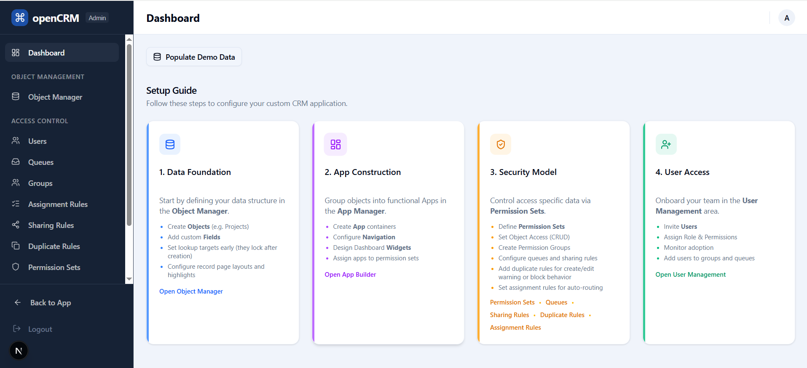

# openCRM Manual

## 01. Overview

### What openCRM is

openCRM is a metadata-driven, multi-tenant CRM. Instead of hardcoding every business entity into a separate part of the product, it lets the system define objects, fields, list views, record pages, apps, dashboards, permissions, and rules through configuration inside the admin area.

In practice, that means the same product can behave like a traditional CRM for companies, contacts, opportunities, and cases, while also supporting custom domains such as patients, providers, appointments, projects, epics, or issues. Each organization works inside its own tenant space, with its own users, apps, records, permissions, and rules.

### How to read this manual

This manual is organized around the actual working surfaces of openCRM. It starts with the day-to-day user experience, then moves into permissions, ownership, metadata, apps, users, and automation.

- **Standard app**: Dashboard, records, search, notifications, and list views.
- **Security and ownership**: Permissions, record ownership, sharing rules, groups, and how admin access differs from standard access.
- **Administration**: Object management, record pages, app design, user management, queues, permission groups, and rule configuration.

### The two main working areas

openCRM has two primary surfaces: the standard app for day-to-day work, and the admin area for configuration.

#### Standard app

- Used for daily work with dashboards, records, search, imports, and notifications.
- Shows only the apps and records the signed-in person can access.
- Uses the left sidebar to move through objects in the current app.

#### Admin area

- Used to configure objects, fields, permissions, record pages, apps, users, queues, groups, and rules.
- Reached by clicking the **Setup** button in the standard app header.
- Acts as the control center for the rest of the system.

*The standard app header includes search, notifications, and the **Setup** button used to move into the admin area.*

*The admin dashboard organizes setup work into data foundation, app construction, security model, and user access.*

### What openCRM manages

- **Business records**: Contacts, companies, cases, opportunities, and custom records such as patients or appointments.
- **Navigation and presentation**: Apps, dashboards, list views, record pages, highlights, and field layout decisions.
- **Control and policy**: Permissions, queues, groups, sharing rules, assignment rules, duplicate rules, and validation rules.

### Manual focus

This documentation explains how the product works from a user and admin point of view. It is meant to read like a manual, with the product screens and workflows as the main focus.

---

Next: [02-standard-app-dashboard-and-records.md](02-standard-app-dashboard-and-records.md)
