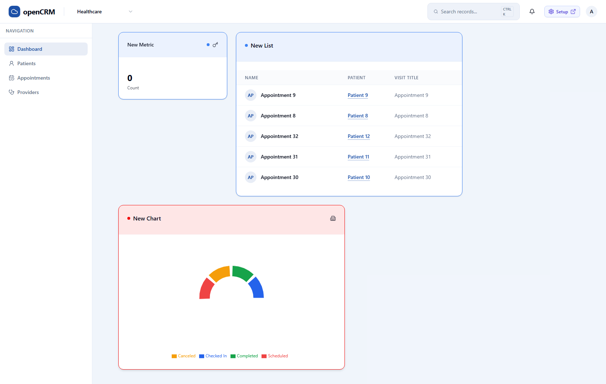
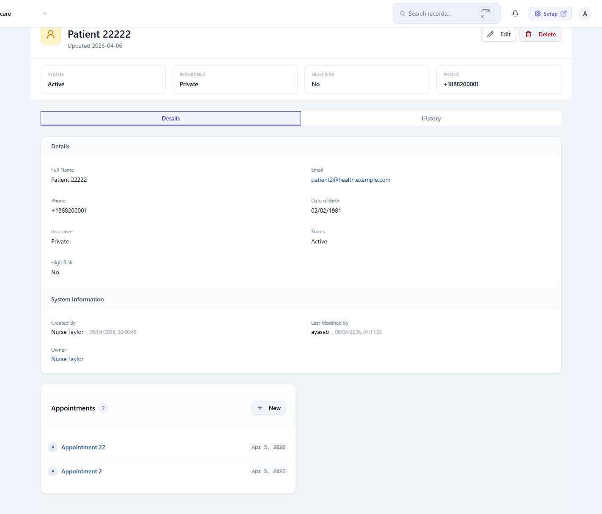
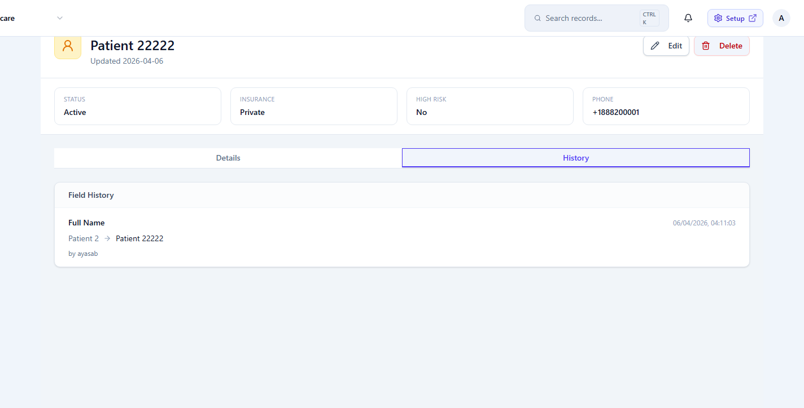
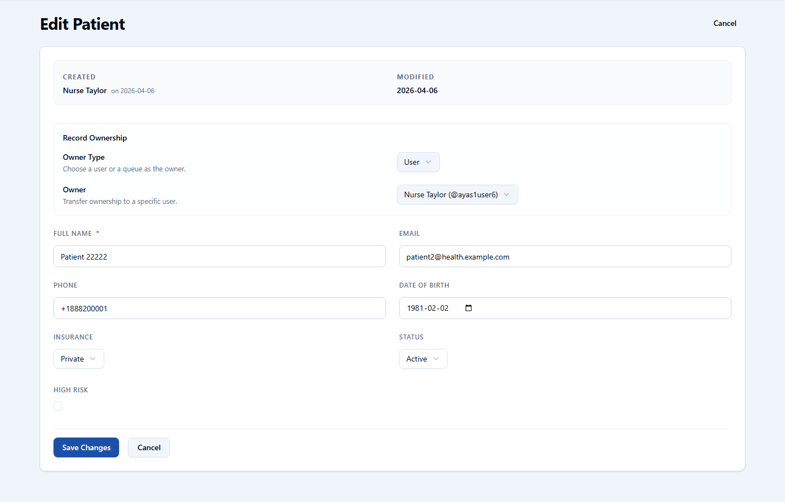

# openCRM Manual

## 02. Standard App: Dashboard and Records

### Daily work happens in the standard app

The standard app is where users open their dashboard, move through object lists, search records, read notifications, and work with record detail pages. The left sidebar changes with the current app, so the same product can feel different for different teams.

### Dashboard

The dashboard is the landing page for the current app. It combines widgets and navigation in one place so people can start work quickly without visiting a dozen setup screens.

- **App-specific navigation**: The sidebar shows the objects that belong to the active app, such as Patients, Appointments, and Providers in the Healthcare app.
- **Search and notifications**: The header gives quick access to search, notifications, and the Setup button for the admin area.
- **Widgets**: Widgets summarize counts, lists, and charts so the dashboard acts as an operational home page, not just a report page.

*This example shows the app switcher, sidebar navigation, widget-based landing view, notification bell, and the Setup button.*

### Records

A record page combines summary information, detailed fields, related records, and history. The same pattern is used across standard objects and custom objects.

#### Detail view

- Headline information at the top
- Important status fields immediately visible
- Tabs for details and history
- Actions such as Edit and Delete

#### Edit flow

- Opens a focused record form
- Shows ownership controls when allowed
- Lets the user update field values in one place
- Applies rules and permissions when saving

*The record page for Patient 52 shows summary fields, related appointments, and the tab structure used for detail and history.*

*The history tab records field changes over time so users can see what changed, when it changed, and who made the change.*

*The edit screen combines ownership settings and business fields in one form so users can update the record without leaving the standard app.*

---

Previous: [01-overview.md](01-overview.md)  
Next: [03-standard-app-search-notifications-and-list-views.md](03-standard-app-search-notifications-and-list-views.md)
