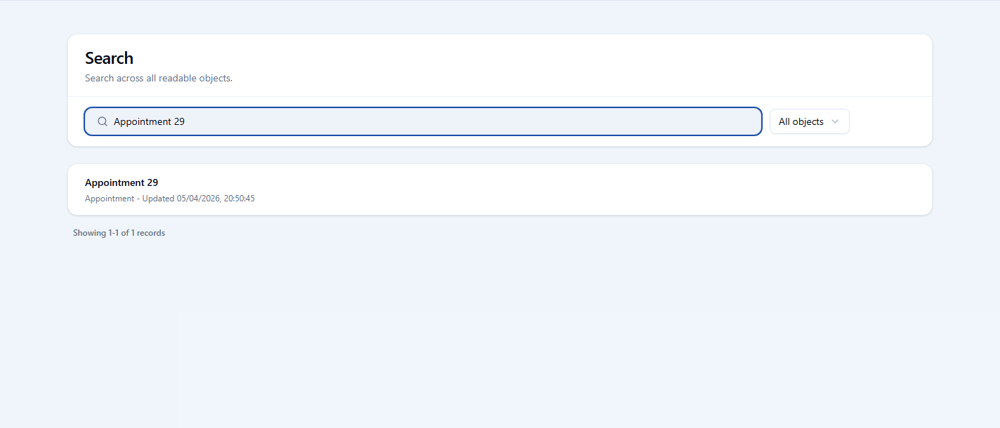
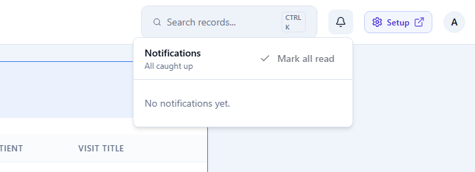
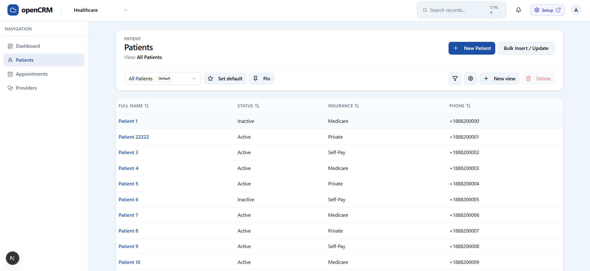
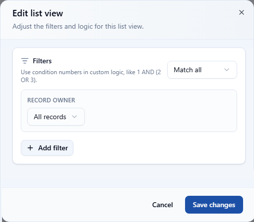
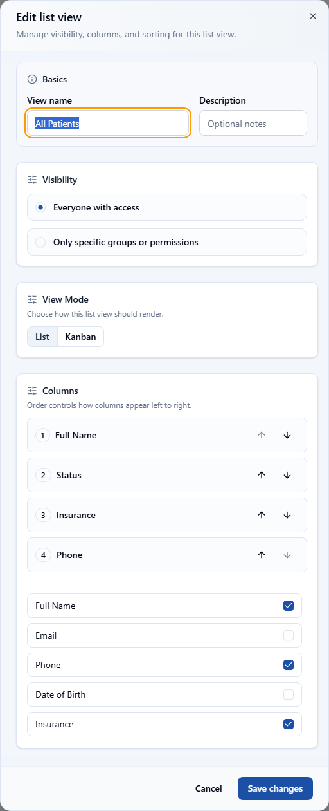

# openCRM Manual

## 03. Standard App: Search, Notifications, and List Views

### Search

Search works across readable records. It can be used from the header or from the dedicated search page, where the user can narrow results by object.

- **What search is for**: Find a record quickly without opening its object list first.
- **What the results page shows**: A query field, an object filter, a paged result list, and only the records the current user is allowed to read.

*This example shows a search for "Appointment 29", with one matching readable record and the object filter set to all objects.*

### Notifications

Notifications live in the header. They are used to surface assignments, mentions, and other attention-worthy events so users do not need to poll every record manually.

- **Where to find them**: Open the bell icon in the header from anywhere in the standard app.
- **Typical events**: Assignment events and comment mentions are the main notification types.
- **Read state**: The notification panel supports marking items as read so the user can clear completed alerts.

*The notification dropdown appears directly under the bell icon in the top-right area of the standard app header.*

### List views

List views decide which records appear, which columns are visible, and how the records are filtered and sorted. They are one of the main productivity tools in openCRM.

*The list page shows the current view, default and pin controls, filter and settings actions, and the records that match the view.*

#### List view filter

The filter editor controls which records appear. It supports match logic, owner scope, and additional conditions, so the view can represent simple or advanced slices of the data.

*The filter editor is where users and admins define which records belong in the view.*

#### List view settings

The settings editor controls the basics of the view, its visibility, the visible columns, sort order, and whether the view should render as a list or a kanban board.

*The settings dialog is where the view name, visibility, columns, and sort order are managed.*

---

Previous: [02-standard-app-dashboard-and-records.md](02-standard-app-dashboard-and-records.md)  
Next: [04-standard-app-imports.md](04-standard-app-imports.md)
