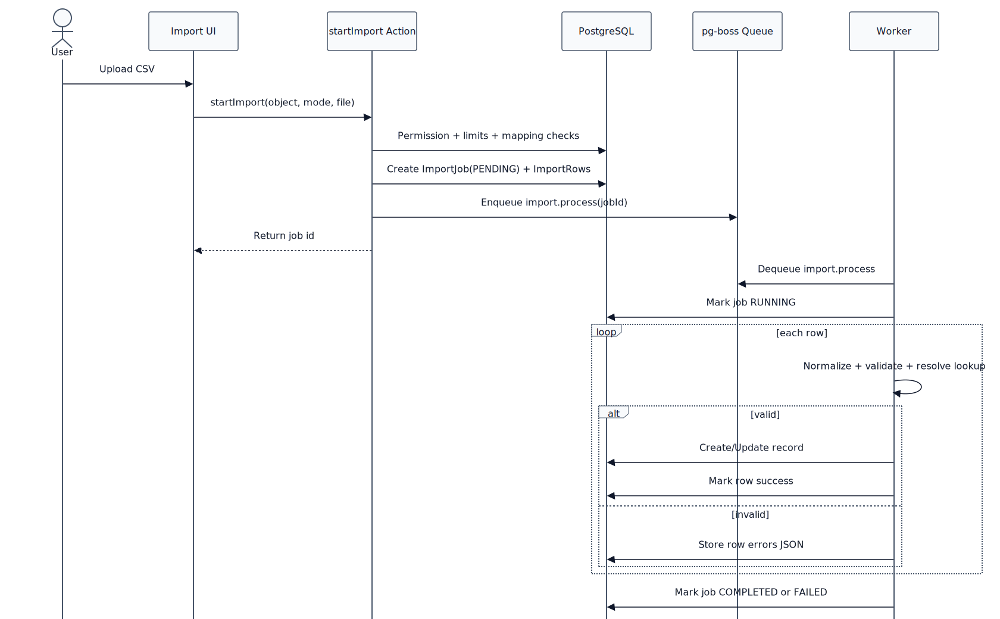
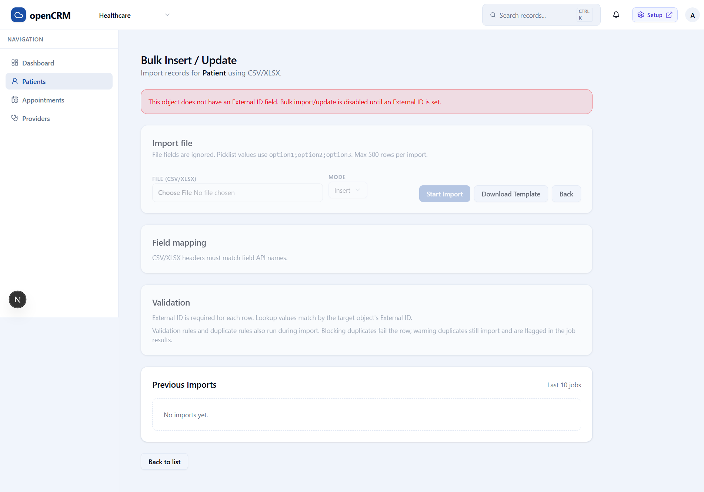

# openCRM Manual

## 04. Standard App: Imports

### Bulk import is asynchronous and depends on external IDs

Imports are staged in two phases: a synchronous upload and validation step, then background row processing by the worker.

### What a user needs before importing

- **Data Loading system permission**
- **Create and or edit access for the target object**
- **An External ID field on the target object**

### What the import page enforces

- **File fields are excluded**
- **Picklist values use API name**
- **CSV headers must match field API names**
- **Lookup values resolve through the target object's External ID**
- **Validation and duplicate rules run during import**
- **Blocking duplicates fail the row; warning duplicates still import and are flagged in the job results**
- **Max 500 rows per import**

### Why the External ID matters

The import flow is designed for insert and update behavior. That only works reliably when the target object has an External ID field that can be used to match rows during import.

*This diagram shows the import flow as a staged process: the user submits the file in the UI, the import job is queued, and the background worker processes rows asynchronously.*

*The running app currently blocks Patient imports because the object does not have an External ID field. That is the expected guardrail on the import page.*

### Previous imports

The import page also shows recent jobs, including status, row counts, success totals, and error totals. This makes the import flow operational instead of one-shot: users can upload, wait for processing, then return to the job list to inspect results.

---

Previous: [03-standard-app-search-notifications-and-list-views.md](03-standard-app-search-notifications-and-list-views.md)  
Next: [05-admin-access-and-permissions.md](05-admin-access-and-permissions.md)
