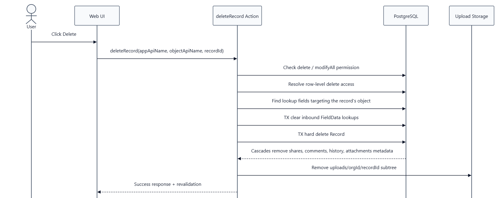
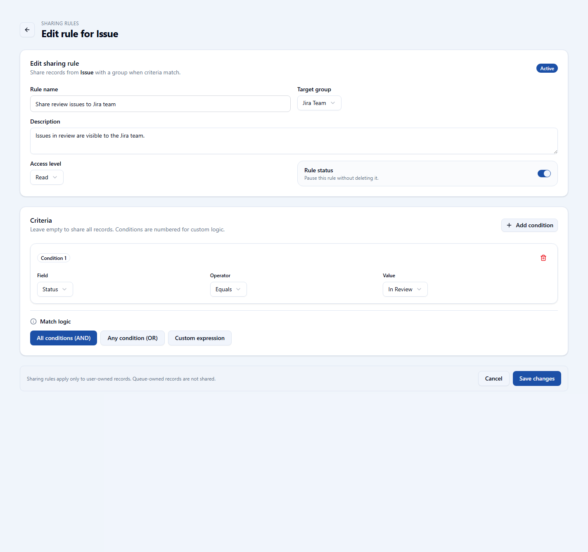

# openCRM Manual

## 06. Record Ownership and Sharing

### Record ownership

Every record has an owner. That owner is either a user or a queue. Ownership affects responsibility, visibility, and who can take the next action on the record.

#### User-owned records

A user-owned record belongs to a specific person. That person becomes the main owner of the work and is the main starting point for record access.

#### Queue-owned records

A queue-owned record belongs to a shared work pool. Queue members can see it, but the record typically needs to be claimed or reassigned before normal user-owner behavior applies.

### Plain-English rule

A person cannot use ownership or sharing to bypass missing object permission. The permission must exist first, and then ownership, queues, or shares can open access to the specific record.

### Record lifecycle

Record access and ownership matter throughout the record lifecycle. Creation checks permissions and rules, edits respect the same access model, and deletes clean up linked data so records do not leave broken references behind.

*This diagram summarizes the main idea: the system checks permission first, then record-level access through ownership, queues, or sharing.*

*The delete flow clears inbound references first and then removes the record and its related metadata in a controlled way.*

### Groups and sharing rules

Groups are used to represent audiences for shared visibility. Sharing rules use those groups to grant additional access when a record matches the rule conditions.

*Groups define the audiences that can receive shared access through sharing rules.*

*The sharing rule area shows how many rules exist per object and gives the entry point for managing them.*

*A sharing rule defines the target group, access level, active status, and the criteria that decide which records are shared.*

### Important ownership rule

Sharing rules apply to user-owned records. Queue-owned records are handled differently and are not shared through this rule type until ownership changes.

---

Previous: [05-admin-access-and-permissions.md](05-admin-access-and-permissions.md)  
Next: [07-object-manager-fields-and-validation.md](07-object-manager-fields-and-validation.md)
