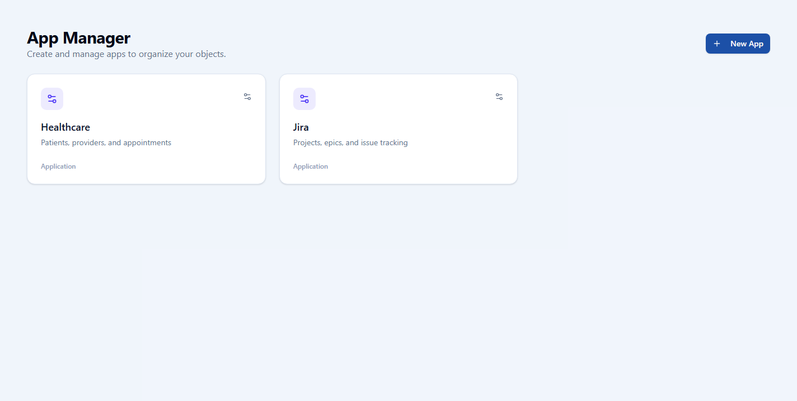
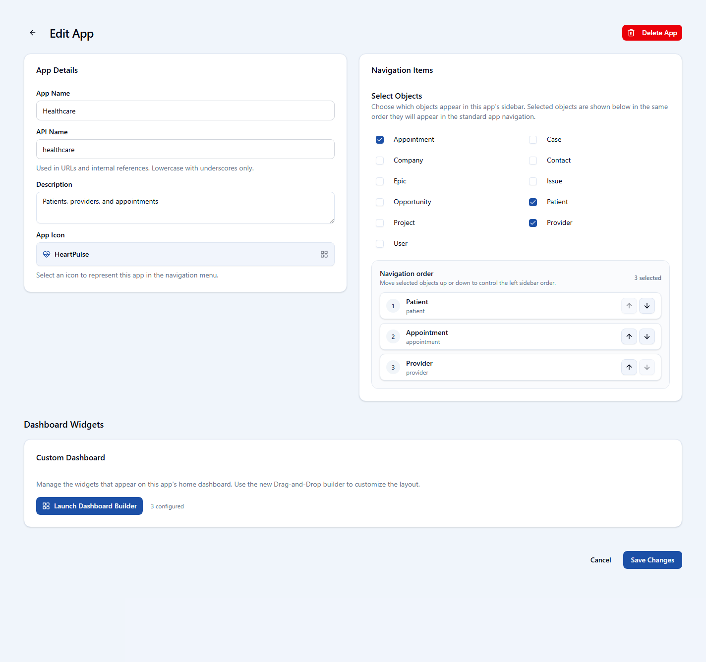
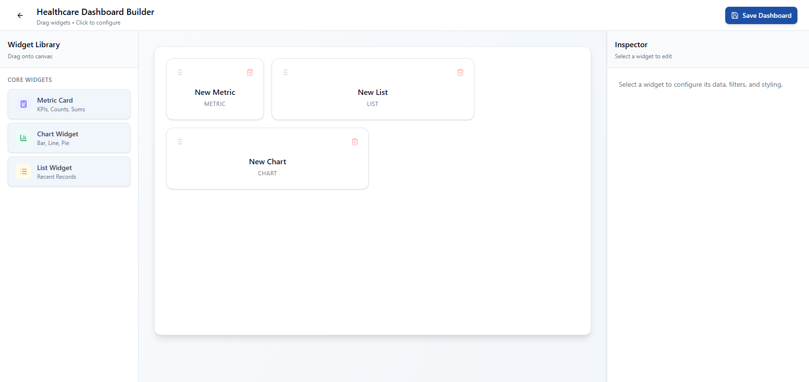
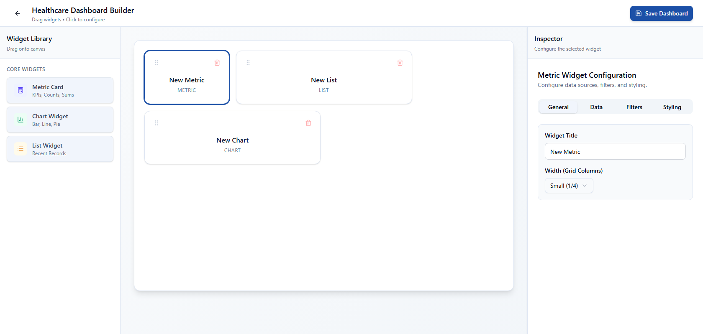

# openCRM Manual

## 09. Apps and Dashboard Builder

### Apps define the workspaces. Users define who can work inside them.

The app layer turns objects into a usable experience by choosing navigation items and dashboard widgets. The user layer decides who gets access to those apps and how each person is represented in the system.

### Apps

Apps are the top-level workspaces people use in the standard app. Each app chooses which objects appear in the sidebar and what the dashboard should show.

*The app manager lists the available apps and acts as the entry point for creating or editing them.*

*The app detail page controls the app name, description, icon, selected objects, navigation order, and widget summary.*

### Dashboard builder

The dashboard builder is where an app's landing page is composed. It gives the administrator a widget library, a layout canvas, and configuration tools for each widget.

- **Widget library**: Provides metric cards, chart widgets, and list widgets.
- **Canvas**: Shows the live arrangement of dashboard widgets.
- **Inspector**: Lets the admin change widget title, size, data, filters, and styling.

*The builder shows the widget library on the left, the layout canvas in the middle, and editing tools on the right when a widget is selected.*

*When a widget is selected, the inspector opens tabs for the widget's general settings, data source, filters, and styling.*

---

Previous: [08-record-pages.md](08-record-pages.md)  
Next: [10-users-and-permission-groups.md](10-users-and-permission-groups.md)
