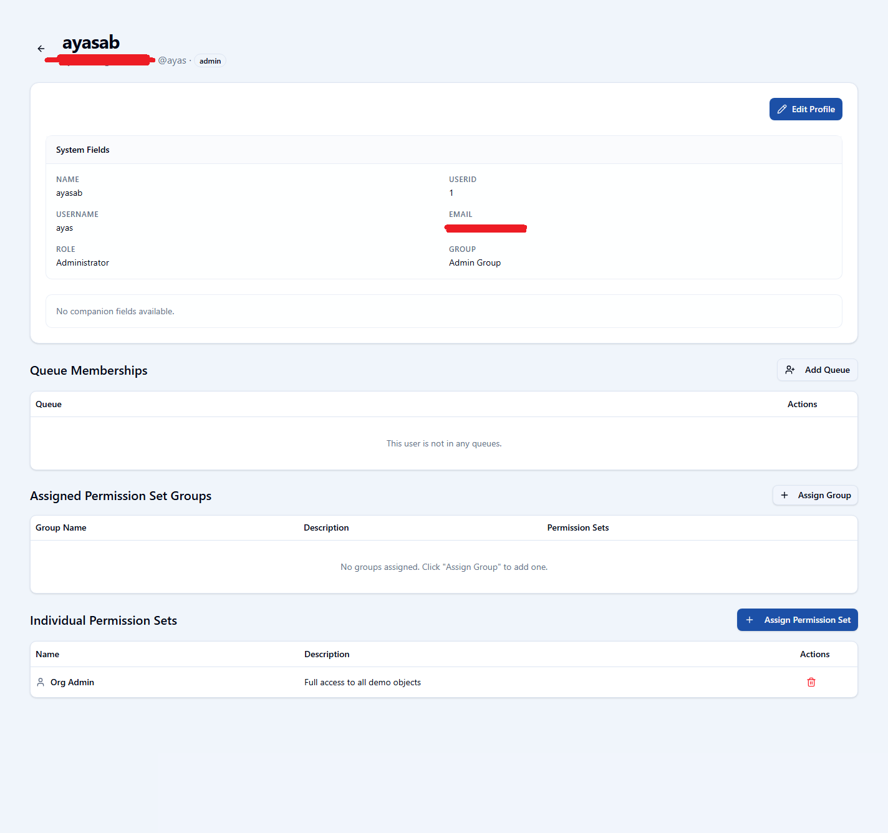
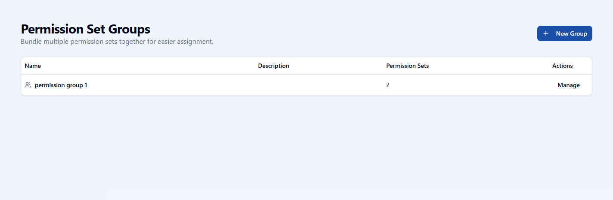
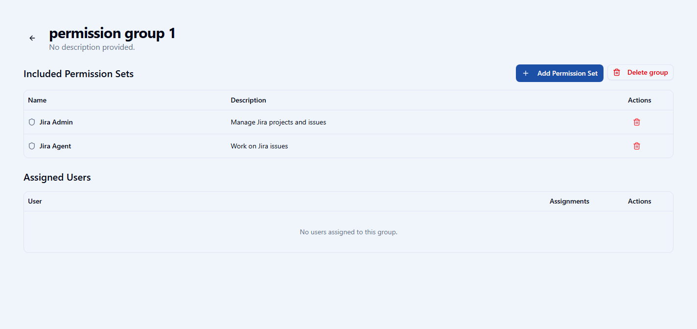

# openCRM Manual

## 10. Users and Permission Groups

### Users

User management covers sign-in identities, profile information, permission assignments, groups, queues, and the person's place inside the CRM.

*The user list gives the administrator a view of names, email addresses, roles, and assigned permission sets.*

*The user detail page shows system identity fields, queue memberships, permission set groups, and individual permission sets.*

### User object and companion record

The user appears as a business record inside openCRM, but it is still tied to the actual application account. This means the person can participate in layouts and CRM-style management while still remaining a real sign-in user.

### Important user rules

- System identity fields stay controlled and protected.
- User-specific custom fields can still be attached to the person's record.
- Users can be added to queues, groups, and permission groups.

### Permission groups

Permission groups bundle multiple permission sets together so access can be assigned more efficiently.

*The permission group list shows the available bundles of permission sets.*

*The detail page shows which permission sets belong to the group and which users are assigned through it.*

---

Previous: [09-apps-and-dashboard-builder.md](09-apps-and-dashboard-builder.md)  
Next: [11-queues-and-groups.md](11-queues-and-groups.md)
