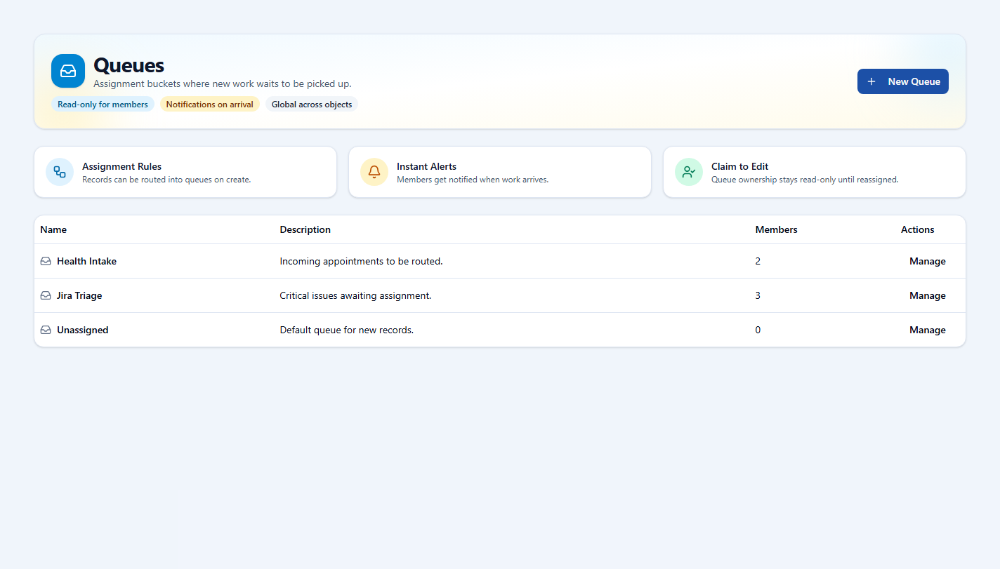
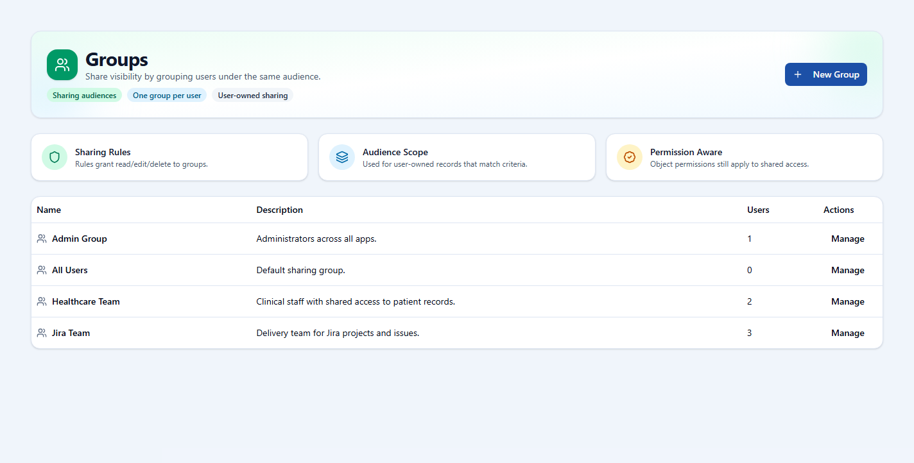

# openCRM Manual

## 11. Queues and Groups

### Queues, rules, and governance areas keep work organized and data controlled.

These areas are where administrators manage shared work pools, route new records, detect duplicates, and package access into reusable groups.

### Queues

Queues are shared ownership buckets. They are useful when new work should land with a team instead of immediately landing with one specific person.

*The queue list is where shared work pools are created and managed.*

### Groups

Groups define audiences for shared visibility. They are often used together with sharing rules to grant access to a broader team without changing record ownership.

*Groups act as named audiences that can be referenced by sharing rules and other administrative setups.*

---

Previous: [10-users-and-permission-groups.md](10-users-and-permission-groups.md)  
Next: [12-assignment-rules.md](12-assignment-rules.md)
