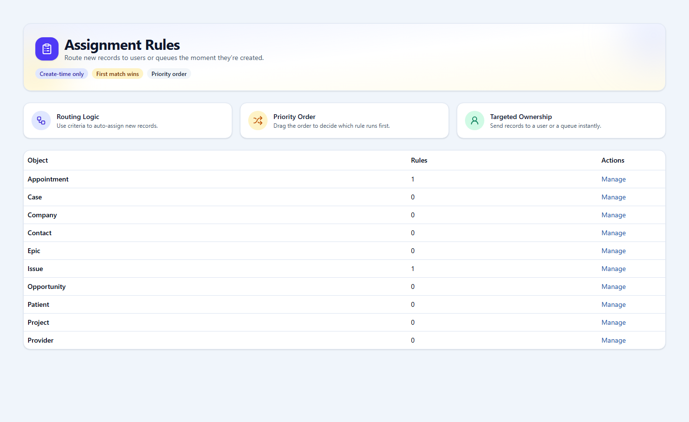
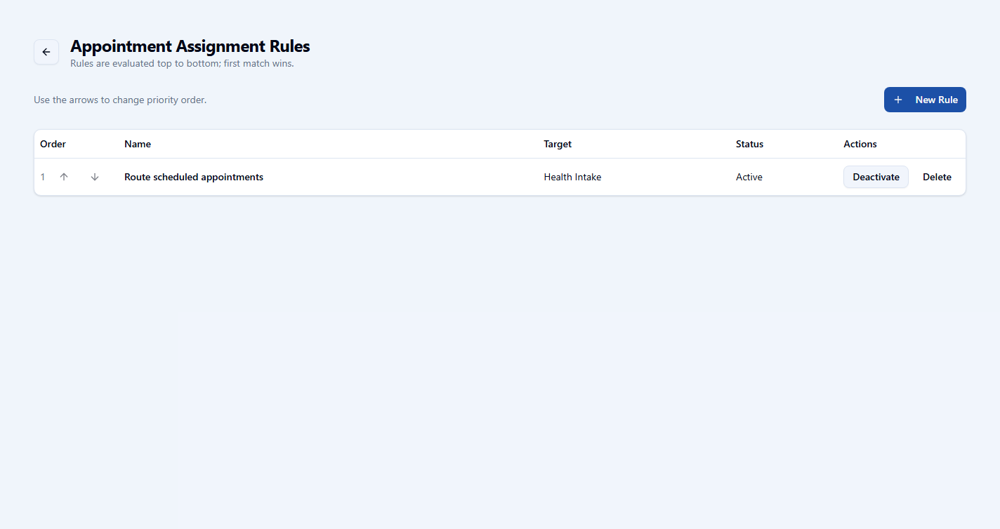
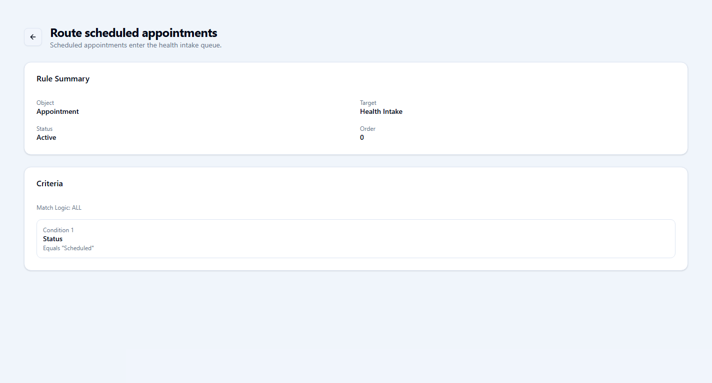

# openCRM Manual

## 12. Assignment Rules

### Assignment rules

Assignment rules decide where a newly created record should go. They are evaluated in order, and the first matching rule wins.

- **What assignment rules do**: Route new records to a user or queue based on criteria.
- **Why order matters**: The rule list is ordered top to bottom, so earlier rules have higher priority.

*The assignment rule home screen shows which objects currently have rule sets to manage.*

*The object-level list shows the current rules, target, active status, and priority order.*

*A rule detail page explains the routing target, current status, and the conditions that trigger the assignment.*

---

Previous: [11-queues-and-groups.md](11-queues-and-groups.md)  
Next: [13-duplicate-rules.md](13-duplicate-rules.md)
