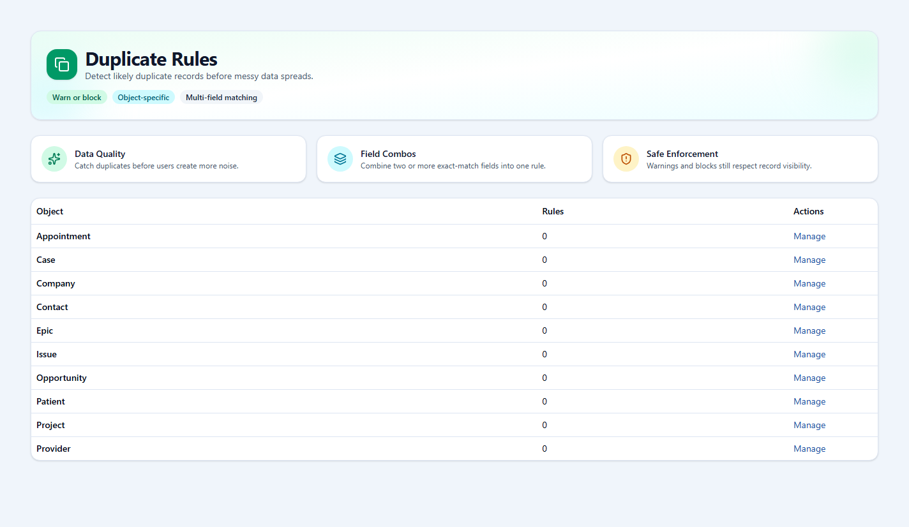

# openCRM Manual

## 13. Duplicate Rules

### Duplicate rules

Duplicate rules help administrators stop or warn about repeated records. They are especially useful where one exact match is not enough and the system should compare several fields together.

*The duplicate rule area starts by showing which objects have duplicate rules configured.*

*The duplicate rule editor defines matching fields, save behavior on create and edit, and how the matching logic should combine conditions.*

---

Previous: [12-assignment-rules.md](12-assignment-rules.md)  
Next: [14-step-by-step-getting-started.md](14-step-by-step-getting-started.md)
