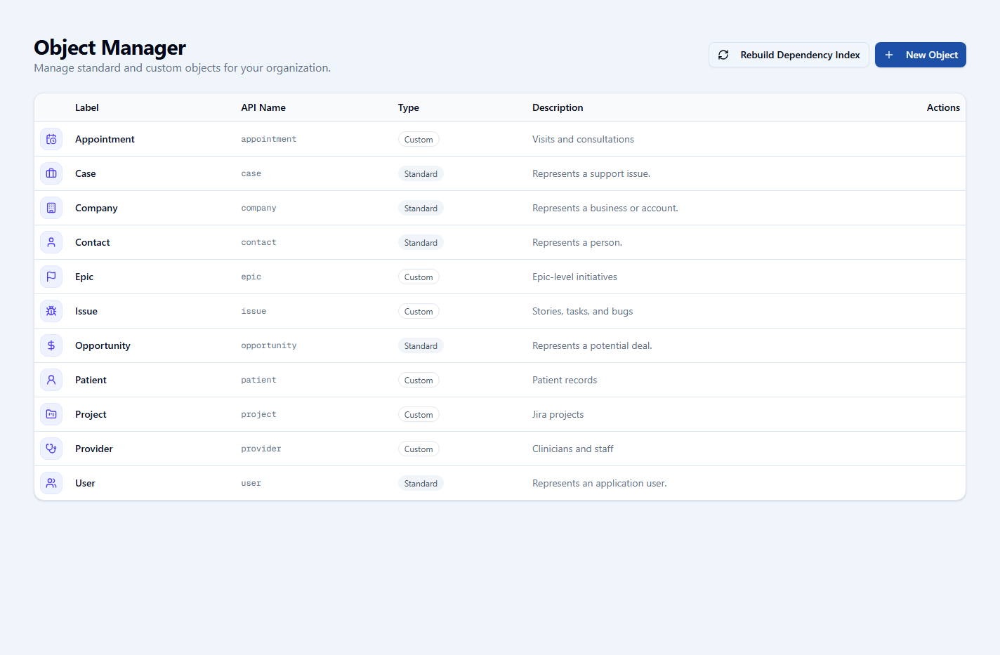
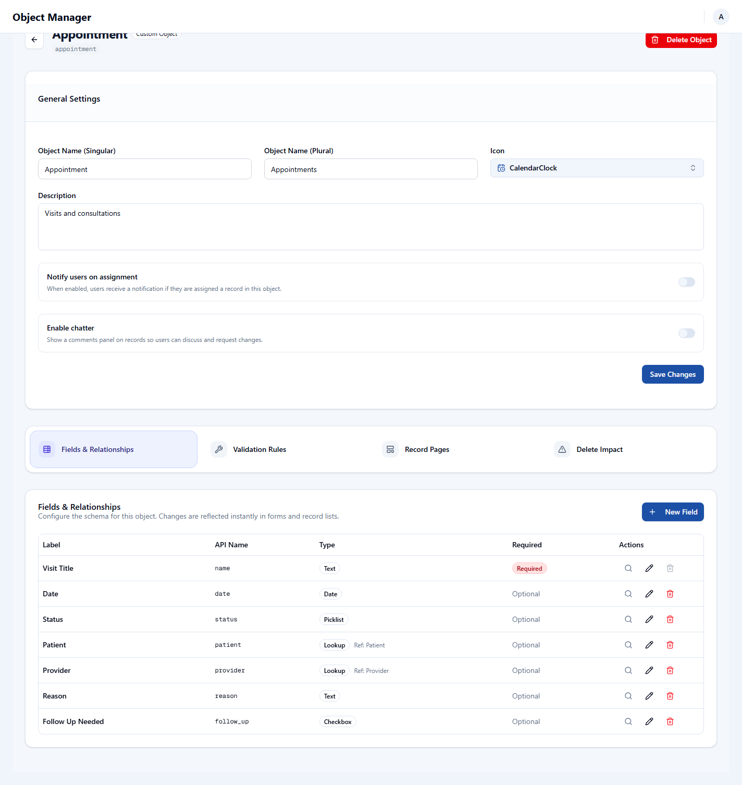
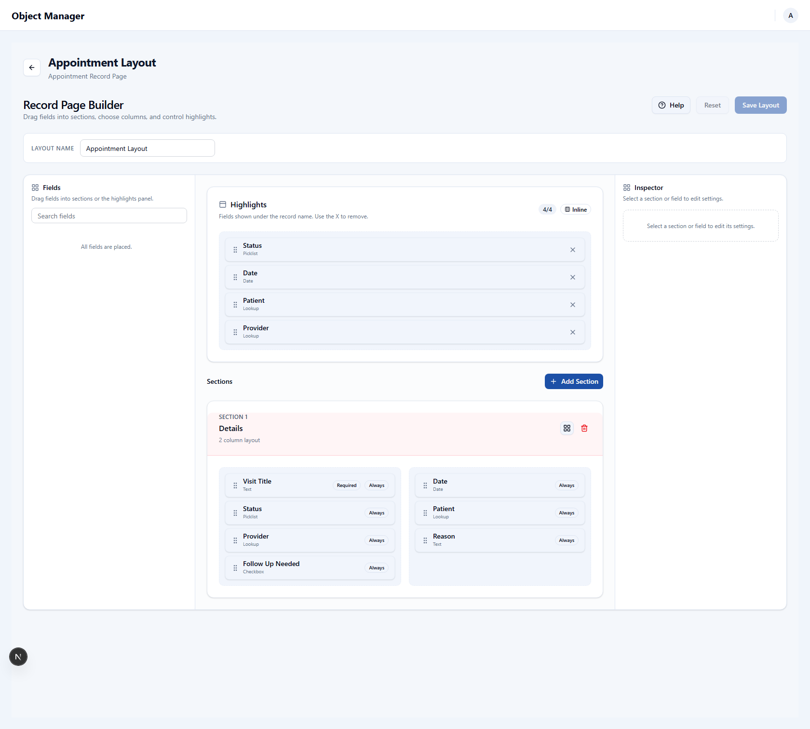
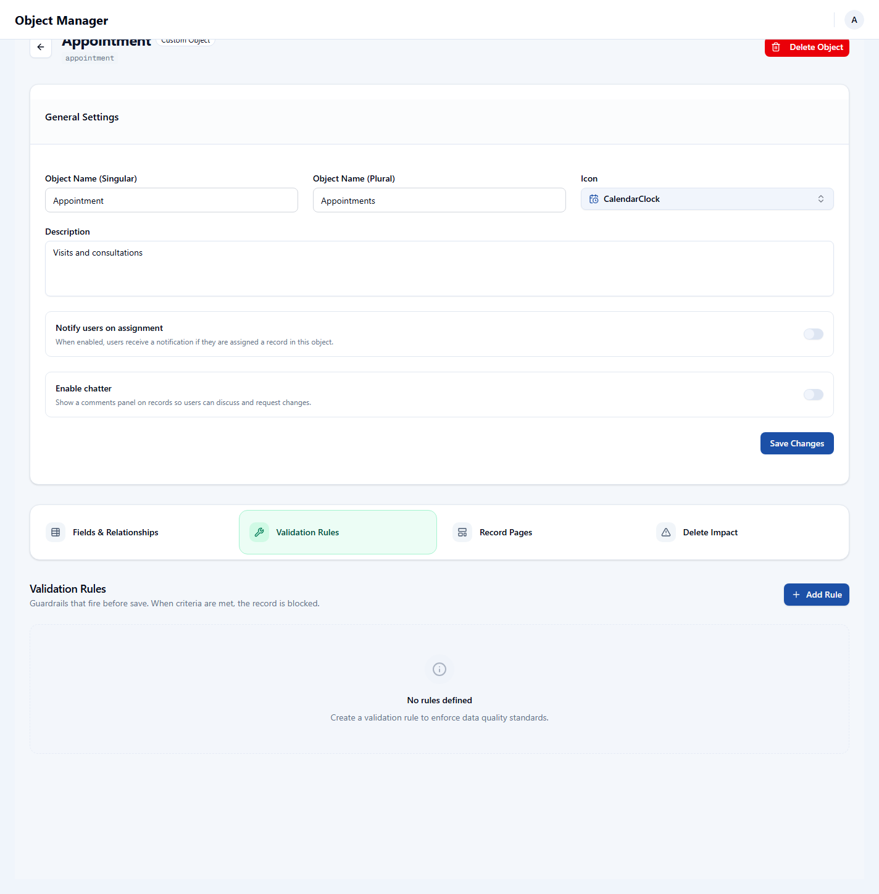
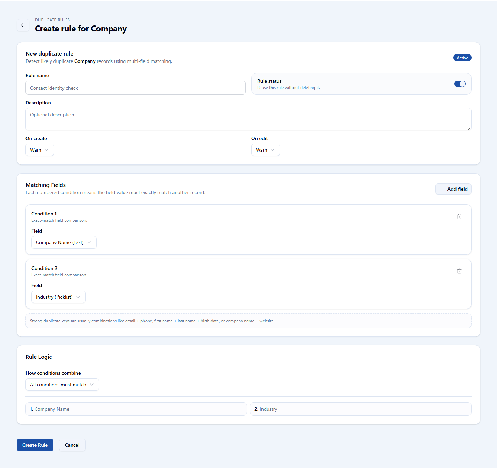
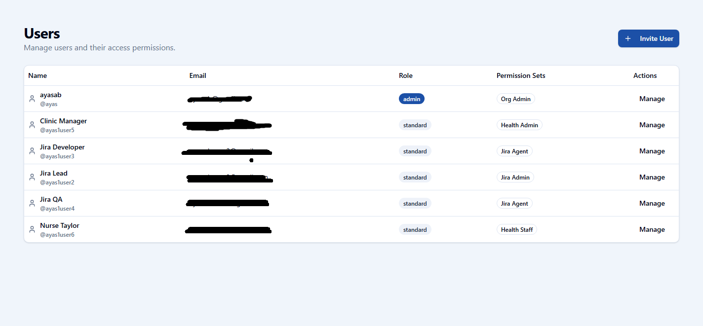
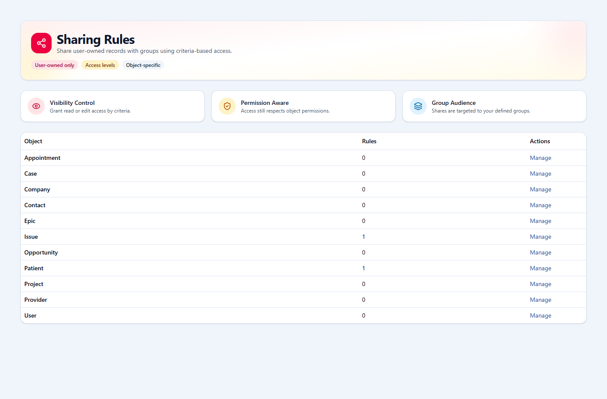
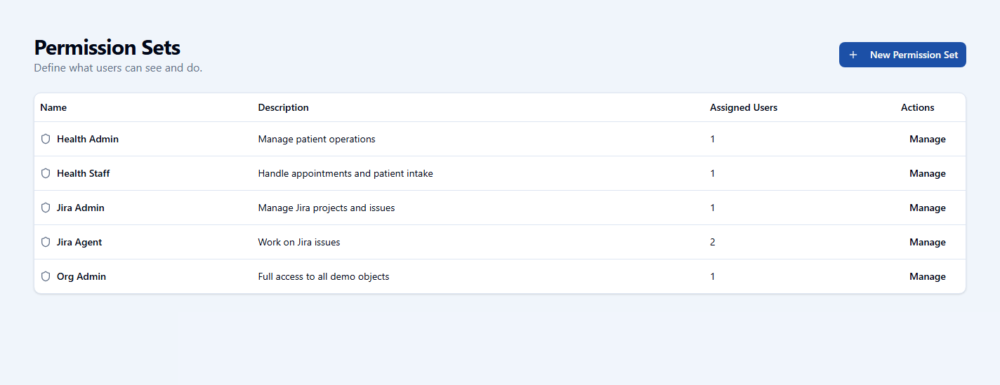
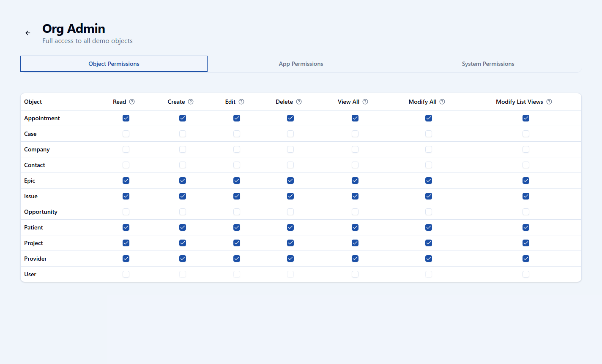

# openCRM Manual

## 14. Step-by-Step Getting Started Workflow

### The recommended setup order

openCRM is easier to configure when you build it in the same order the platform expects. The goal is to define your data first, then shape the user experience, then set access, and only then load real data.

### 1. Register

Create the first account for the organization. This gives you the initial entry point into the platform so you can start the first-time setup.

Why this comes first:

- You need an account before you can create anything else.
- The first user is the one that sets up the foundation for the rest of the organization.

### 2. Log in

After registration, sign in and open the standard app. From there, use the **Setup** button to move into the admin area.

Why this comes next:

- The standard app is where you confirm the account is active.
- The admin area is where all metadata and access setup happens.

*The standard app is the normal working surface. The **Setup** button in the top-right header is how you enter administration.*

### 3. Create your objects

Objects define what kinds of records your CRM will manage. This is where you decide whether your organization needs things like Patients, Projects, Vendors, Cases, or other custom business entities.

Why this comes before almost everything else:

- Apps, pages, rules, and imports all depend on the object existing first.
- The object is the container for fields, validation rules, duplicate rules, and layouts.

*Start in the object manager so the core data model exists before you build the rest of the experience.*

### 4. Create fields

Once the object exists, add the fields that store the information the object needs. This includes text values, dates, numbers, checkboxes, picklists, lookups, files, and auto numbers.

Why this happens immediately after object creation:

- Record pages cannot be useful until the fields exist.
- Validation, duplicate logic, and imports all depend on field definitions.

*The object detail page is where the field structure, relationships, and object-level setup are managed.*

### 5. Create the record page

After the fields exist, shape how users will see the record. Choose the highlight fields, section layout, and which fields are grouped together.

Why this comes before giving users access:

- Users should not be sent into a raw object with no usable page layout.
- The record page is what turns the object structure into a working CRM experience.

*The record page builder defines what users see when they open a record in the standard app.*

### 6. Create validation rules if needed

Validation rules are optional, but they are often useful once the fields are known. Add them when certain combinations of values should be blocked or required before a record can be saved.

Why this belongs here:

- You need the fields first.
- It is easier to enforce data quality before users and imports start creating records at scale.

*Validation rules help keep records clean by blocking saves that do not meet the business rules.*

### 7. Create duplicate rules if needed

Duplicate rules are also optional. Use them if the object should warn or block when records look like repeats.

Why this comes before import:

- Duplicate protection is most useful before a large amount of data is added.
- It reduces cleanup work later.

*Duplicate rules define how openCRM compares fields and whether matching records should warn or block.*

### 8. Add an External ID field if you plan to use data loading

An External ID field is optional for general record entry, but it becomes important if you want to bulk import and update data.

Why this matters:

- Bulk import and update depend on an External ID.
- Lookups during import also match through External ID values.

### 9. Create your app and assign the objects

Once the objects and record pages exist, create the app workspace and decide which objects belong in its sidebar. Then shape the dashboard so users land in a useful workspace.

Why the app is created after the data model:

- The app needs real objects to include.
- Dashboard widgets and navigation are easier to configure when the underlying records already exist.

*Apps turn the object model into a usable workspace with navigation, dashboard widgets, and a clearer team-specific experience.*

*The dashboard builder is where the app landing page becomes operational instead of empty.*

### 10. Create your additional standard users

After the workspace exists, create the users who will work inside it. At this stage, the app and data structure are already in place, so those users are being added to a usable environment.

Why this step is not first:

- It is easier to onboard people after the workspace exists.
- You avoid creating accounts before access rules and app structure are ready.

*Create the people who will use the system after the core setup is ready.*

### 11. Create your groups

Groups represent audiences. Use them when you need a named collection of users that can be referenced in sharing rules.

### 12. Assign users to groups

Once the groups exist, add the correct users so those audiences are meaningful.

### 13. Create sharing rules

After users and groups exist, define when records should be shared to those groups.

Why this sequence matters:

- Groups are the target audience for sharing rules.
- Sharing rules are only useful after there are real users to receive the shared access.

*Groups define the audiences that sharing rules can target.*

*Sharing rules extend record access after the base permission and ownership model is already in place.*

### 14. Create a permission set

Create permission sets to define what a person can do on each object, which apps they can open, and which system capabilities they should have.

Why this comes after app and object setup:

- Permission sets are easier to define when the real apps and objects already exist.
- The access model should match the workspace you just built.

*Permission sets are the main place where app access, object access, and system capabilities are bundled together.*

*The detail page is where object-level access, app access, and system permissions are assigned.*

### 15. Assign permissions to users

After the permission set exists, assign it to the correct users so they can open the right apps and work with the right records.

Why this is one of the final setup steps:

- Permissions should reflect the final app, object, and sharing design.
- Assigning access too early often creates rework.

### 16. Import your data

With the data model, record page, app, users, sharing model, and permissions all in place, you can load data into the system.

Why import should come near the end:

- The system should already know what the records look like.
- Validation rules and duplicate rules should already be active.
- The right users should already have access to work with the imported records.

*The import workflow is asynchronous. The file is submitted first, then the queued worker processes the rows and records the results.*

*Bulk import works best after the object model, validation, duplicate logic, and permissions are already configured.*

### The short version

If you want the simplest practical order, use this:

1. Register
2. Log in
3. Create objects
4. Create fields
5. Create record pages
6. Add validation rules if needed
7. Add duplicate rules if needed
8. Add an External ID field if you plan to import
9. Create the app and assign objects
10. Create additional users
11. Create groups
12. Assign users to groups
13. Create sharing rules
14. Create permission sets
15. Assign permissions to users
16. Import data

---

Previous: [13-duplicate-rules.md](13-duplicate-rules.md)
